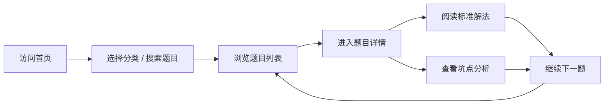

## 1. 产品概述

程序员面试题库网站，为技术求职者提供高质量的面试题目及深度解析。覆盖Java、数据库、缓存、消息队列、系统设计等核心方向，每道题不仅提供标准解法，还重点剖析实际项目中容易踩坑的点，帮助用户从"背题"到"真正理解"。

- **核心价值**：区别于普通题库，强调"坑点"分析，还原真实面试场景
- **目标用户**：初中高级工程师、准备跳槽的技术人员、校招应届生

## 2. 核心功能

### 2.1 用户角色

| 角色 | 注册方式 | 核心权限 |
|------|----------|----------|
| 访客 | 无需注册 | 浏览题目分类、查看题目列表、阅读题目详情 |

### 2.2 功能模块

1. **首页**：分类导航、热门题目、搜索入口、学习统计
2. **分类题库页**：按方向展示题目列表，支持筛选、排序
3. **题目详情页**：题目描述、标准解法、坑点分析、代码示例
4. **搜索功能**：全站搜索题目，支持关键词高亮

### 2.3 页面详情

| 页面名称 | 模块名称 | 功能描述 |
|----------|----------|----------|
| 首页 | Hero区域 | 大标题、副标题、搜索框、分类快速入口 |
| 首页 | 分类卡片 | Java、数据库、缓存、消息队列、系统设计五大方向卡片 |
| 首页 | 热门题目 | 展示高频面试题Top列表 |
| 首页 | 学习进度 | 展示已刷题数、掌握程度统计 |
| 分类题库页 | 分类筛选 | 侧边栏分类导航，支持切换方向 |
| 分类题库页 | 题目列表 | 卡片式题目列表，显示难度、题号、标题 |
| 分类题库页 | 难度筛选 | 简单/中等/困难三级筛选 |
| 题目详情页 | 题目内容 | 题目描述、难度标签、分类标签 |
| 题目详情页 | 标准解法 | 结构化的解题思路和代码实现 |
| 题目详情页 | 坑点分析 | 红色警示样式的踩坑提醒 |
| 题目详情页 | 相关推荐 | 同类型题目推荐 |

## 3. 核心流程

用户访问网站 → 浏览首页分类或使用搜索 → 选择感兴趣的分类 → 浏览题目列表 → 点击进入题目详情 → 阅读标准解法和坑点分析 → 继续浏览其他题目

## 4. 用户界面设计

### 4.1 设计风格

- **主色调**：深蓝(#165DFF) + 深灰背景(#0F172A)，营造专业技术感
- **辅助色**：橙色(#FF7D00)用于"坑点"警示，绿色(#00B42A)用于正确提示
- **按钮风格**：圆角矩形，悬停有微妙的发光效果
- **字体**：标题使用JetBrains Mono等宽字体增强技术感，正文使用现代无衬线字体
- **布局风格**：卡片式布局，深色模式为主，代码高亮主题
- **视觉元素**：代码编辑器风格的边框、终端风格的提示、代码片段高亮

### 4.2 页面设计概述

| 页面名称 | 模块名称 | UI元素 |
|----------|----------|--------|
| 首页 | Hero区域 | 渐变背景、打字机效果标题、发光搜索框、图标分类 |
| 首页 | 分类卡片 | 悬浮上移动效、图标渐变色、难度进度条 |
| 分类题库页 | 侧边栏 | 激活态高亮、分类图标、题目数量角标 |
| 分类题库页 | 题目卡片 | 难度标签色彩区分、hover阴影加深 |
| 题目详情页 | 标准解法 | 折叠面板、代码块语法高亮、步骤序号 |
| 题目详情页 | 坑点分析 | 红色警示边框、感叹号图标、逐条列举 |

### 4.3 响应式

- 桌面端优先设计，自适应平板和手机
- 移动端侧边栏转为底部导航或抽屉菜单
- 代码块在小屏幕支持横向滚动
- 触摸优化：增大点击区域，优化滑动体验

