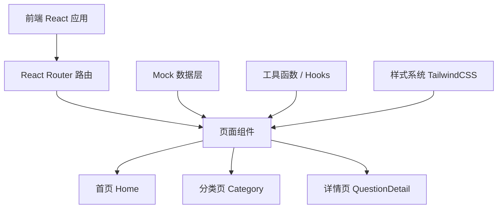
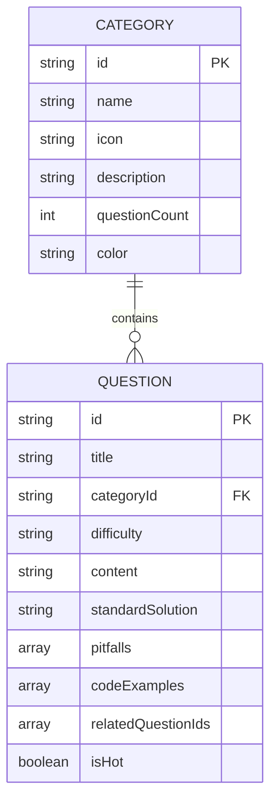

## 1. 架构设计



## 2. 技术描述

- **前端框架**: React@18 + TypeScript
- **构建工具**: Vite
- **样式方案**: TailwindCSS@3
- **路由**: React Router DOM@6
- **代码高亮**: react-syntax-highlighter
- **图标**: Lucide React
- **数据**: 本地 Mock 数据（JSON格式）
- **状态管理**: React useState + useContext（轻量级）

## 3. 路由定义

| 路由 | 页面 | 用途 |
|------|------|------|
| / | 首页 | 分类导航、热门题目、搜索入口 |
| /category/:categoryId | 分类题库页 | 按分类展示题目列表 |
| /question/:questionId | 题目详情页 | 题目内容、标准解法、坑点分析 |
| /search?q=keyword | 搜索结果页 | 全站搜索结果展示 |

## 4. 数据模型

### 4.1 数据模型定义



### 4.2 数据结构定义

```typescript
interface Category {
  id: string;
  name: string;
  icon: string;
  description: string;
  questionCount: number;
  color: string;
}

interface CodeExample {
  language: string;
  code: string;
}

interface Pitfall {
  title: string;
  description: string;
  severity: 'high' | 'medium' | 'low';
}

interface Question {
  id: string;
  title: string;
  categoryId: string;
  difficulty: 'easy' | 'medium' | 'hard';
  content: string;
  standardSolution: string;
  pitfalls: Pitfall[];
  codeExamples: CodeExample[];
  relatedQuestionIds: string[];
  isHot: boolean;
}
```

## 5. 项目目录结构

```
src/
├── components/          # 通用组件
│   ├── Header.tsx       # 顶部导航
│   ├── CategoryCard.tsx # 分类卡片
│   ├── QuestionCard.tsx # 题目卡片
│   ├── CodeBlock.tsx    # 代码高亮组件
│   ├── PitfallCard.tsx  # 坑点卡片
│   └── SearchBar.tsx    # 搜索组件
├── pages/               # 页面组件
│   ├── Home.tsx         # 首页
│   ├── Category.tsx     # 分类页
│   └── QuestionDetail.tsx # 详情页
├── data/                # Mock数据
│   ├── categories.ts    # 分类数据
│   └── questions.ts     # 题目数据
├── hooks/               # 自定义Hooks
│   └── useQuestions.ts  # 题目相关逻辑
├── types/               # 类型定义
│   └── index.ts
├── App.tsx
├── main.tsx
└── index.css
```

## 6. 核心功能实现思路

### 6.1 搜索功能
- 前端实现：基于题目标题和内容的模糊匹配
- 使用 `useMemo` 优化搜索性能
- 支持关键词高亮显示

### 6.2 代码高亮
- 使用 `react-syntax-highlighter` 库
- 支持 Java、SQL、JavaScript 等多种语言
- 深色主题，与整体风格统一

### 6.3 响应式设计
- TailwindCSS 断点：sm / md / lg / xl
- 移动端侧边栏转为抽屉式导航
- 网格布局自适应列数

